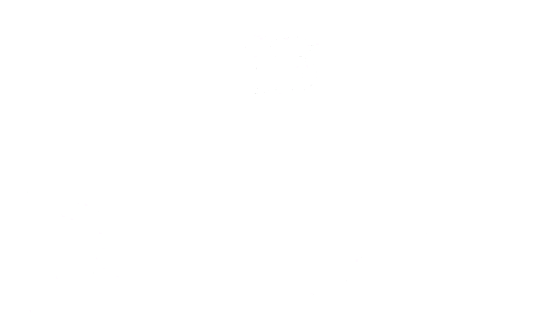

> Framework for Defining Actions to Perform in Skyrim (for bots)

## Goals:

- [ ] MessageBox on game load
- [ ] Can run MCM recording actions (TODO)
- [ ] Prompt for option (arbitrary list)
- [ ] Prompt for confirmation (buttons)
- [ ] Fade screen to black & back
- [ ] Give player items
- [ ] Do something on save game load
- [ ] Do something when RaceMenu closes
- [ ] Open RaceMenu
- [ ] Load RaceMenu preset
